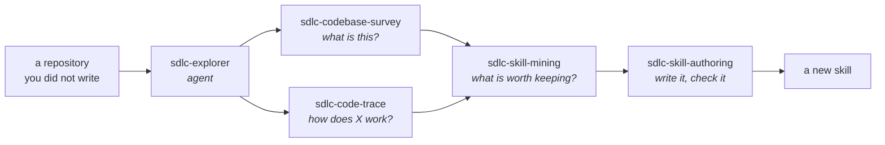

# The factory — the explorer agent and its skills

**What is built, why it is shaped this way, and how to use it.**

Written 2026-08-03. The plan this came from is [PROPOSAL.md](PROPOSAL.md); this
document describes only what exists.

These pieces are Tier 0 — the part of the toolbox that **builds the rest of the
toolbox**. They read a codebase, decide what in it is worth keeping, and turn
that into a new skill. Everything in later tiers gets made with them.

---

## What is here

| Piece | Kind | One line |
|---|---|---|
| `sdlc-explorer` | agent | Read-only archaeology. Returns findings with `file:line` anchors, never file contents. |
| `sdlc-codebase-survey` | skill | Breadth-first. Map an unfamiliar repository. |
| `sdlc-code-trace` | skill | Depth-first. Follow one behaviour from entry point to effect. |
| `sdlc-skill-mining` | skill | Turn what a team does repeatedly into a candidate skill brief. |
| `sdlc-skill-authoring` | skill | Turn a brief into a working skill, and enforce the standard with `check.py`. |

They chain in one direction:



The left half reads. The right half decides and writes. The boundary between
them is an agent boundary, and that is deliberate — see below.

---

## The two rules that produced this shape

Everything else follows from these, so they are worth stating before the parts.

### 1. An agent exists only when isolation buys something

The obvious design is one agent per lifecycle phase — requirements, design,
code, test, deploy. It is rejected here, because **phases are not context
boundaries**. Real work is one loop (*understand → change → verify*) run at
different altitudes, and every agent spawn starts **cold**: it re-derives
context that already existed. Phase-agents mean paying that tax five times to
ship one change.

An agent is justified by exactly four things, all about context rather than
subject:

- the work reads far more than the answer is worth carrying back
- the job requires *not* having a capability
- the result is invalid if the same context produced the thing being judged
- there is a conflict of interest with the caller's goal

`sdlc-explorer` qualifies on the first. **Mining and authoring qualify on
none**, which is why they are skills you invoke directly rather than agents you
dispatch: their product is *your judgment* — which convention is worth keeping,
whether a description will fire — and a cold-start agent cannot supply that.

### 2. One skill is one procedure with one stopping condition

Surveying and tracing are the same topic and two skills. They have opposite
search directions — a survey works outward from the build manifest, a trace
works *backwards* from the observed effect toward the entry point — and, more
importantly, different stopping conditions:

- a **survey** is done when someone else can decide where to look
- a **trace** is done when the path is connected, or the unresolved hop is named

Merged into one skill, each stopping rule would license the other's failure
mode: surveys that never end, traces that wander into unrelated files. When two
procedures have different stopping conditions, they cannot share a skill,
however related the subject.

---

## The pieces

### `sdlc-explorer` — the agent

**What it does.** Answers questions that need a lot of reading and a short
answer: *how does authentication work here*, *where is X implemented*, *what is
this repo*, *why was this written this way*.

**Why it is shaped this way.** Its whole value is the ratio between what it
reads and what it returns. So its output contract is the first thing in the
file, and it is strict: the answer in one or two sentences, then `file:line`
anchors as evidence, then **what it could not establish**. It never pastes a
file. If the caller has to open the files anyway, the agent cost a context
window and saved nothing.

The third part is not politeness. An honest gap and a confident guess are
indistinguishable to the caller — so a trace that stops at an unresolved hop and
says so is a *result*, while one that bridges the gap plausibly is a wrong
answer that reads like a right one.

**Why it holds `Bash`.** Archaeology without `git log`, `git blame` and
`git log -S` loses the ability to answer *why*, which is often the real
question. `Bash` implies write capability, so the restriction is stated in
prose instead: no creating, editing or deleting; no staging, committing or
checking out; no installers, formatters or generators; no build or test command
that writes to the tree. **Prose is a weaker guarantee than omission** — if you
want the guarantee more than the history, remove `Bash` and `sdlc-code-trace`
loses its evidence step.

**How to use it.**

```
Use sdlc-explorer to work out how <project> handles background jobs.
```

Or just ask the question — the `description` is written as a routing key, so
"where does the retry logic live in <project>" should dispatch it on its own.

---

### `sdlc-codebase-survey` — breadth-first

**What it does.** First contact with a repository: what it is, what builds and
tests it, where control enters, what the major parts are, which conventions are
actually in force.

**The rule it is built on:** *executable documentation outranks written
documentation.* A README states what someone intended on the day they wrote it,
and nothing fails when it stops being true. A CI pipeline, a build script and a
test suite are executed — they cannot drift without something going red. So the
procedure reads the manifest and the pipeline **before any source file**, and
when the two disagree it reports the disagreement as a finding, because that gap
usually marks either the newest thing in the repo or the most abandoned.

**Why it forbids counts.** File and line counts are dominated by generated and
vendored code, answer no question anyone asked, and go stale immediately. Step 2
of the procedure exists to separate authored code from noise before anything is
measured at all.

**How to use it.**

```
/sdlc-codebase-survey
Survey D:\Dev.Work\some-project — I am picking it up on Monday.
```

Output is a one-page map: stack, build command, test command, entry points with
anchors, the shape and its seams, the conventions observed, and the unknowns.

---

### `sdlc-code-trace` — depth-first

**What it does.** Follows one behaviour through the code and reports the path,
hop by hop, anchored.

**The decision that dominates it:** the anchor. The procedure insists on the
*most distinctive string in the system* rather than the most relevant-sounding
one — an error message, a route, a header name, a feature-flag key, a magic
constant. Generic anchors (`handler`, `service`, `process`, `validate`) return a
hundred matches and teach nothing. And it searches **backwards from the effect**
rather than forwards from `main`, because that shrinks the search space instead
of growing it.

**It expects the thread to break, and says where.** Grep does not follow
dependency injection, events and queues, reflection, code generation,
config-driven dispatch, or framework lifecycle hooks. Each has its own
technique, and each is listed. *"The thread breaks here at an event boundary;
the topic is `order.settled` and three subscribers register for it"* is a
complete finding. Guessing which subscriber runs is not.

**How to use it.**

```
/sdlc-code-trace
In <project>, what produces the 401 when a token has expired?
```

A question with no starting input and no observable effect is a survey question
in disguise; the skill will say so and ask you to pick one.

---

### `sdlc-skill-mining` — evidence into a brief

**What it does.** Finds what a team does repeatedly and produces a **candidate
brief** — a proposed skill with its evidence, its stack-specific parts split
out, its checkable rules identified, and a confidence level per rule.

**The judgment it exists for:** *a convention and an accident look identical in
a grep.* Twenty files doing the same thing might be two years of a team
converging, or one person's afternoon. The code cannot tell you which; `git log`
can. Many authors, a long span and survival through a refactor mean a
convention. One author, a short span and never revisited mean a habit.

**The test that makes a skill survive a second project:** *would this still be
right on a different stack?* Yes → it is the procedure, and belongs in
`SKILL.md`. No → it is stack detail, and belongs in `stacks/<name>.md`. Only
true because of this repo's framework or legacy → it is not a skill at all.
Skip that split and you have written `sdlc-<thing>-for-that-one-repo` under a
name that promises more.

**Why it stops at a brief.** Writing the skill in the same pass means the parts
you were least sure of arrive in the same authoritative voice as the parts you
verified. The brief carries provenance — repo, commit, date, and per-rule
confidence — so the skill can be re-checked against the project that justified
it, years later, when that project has moved on.

**How to use it.**

```
/sdlc-skill-mining
Mine the code review practices out of D:\Dev.Work\some-project.
```

It will dispatch `sdlc-explorer` for the evidence and come back with a brief,
including what it looked at and **chose not to mine**, which stops the next
person re-mining the same dead end.

---

### `sdlc-skill-authoring` — brief into skill

**What it does.** The standard every skill here is held to: directory shape,
frontmatter contract, how to write a description that routes, when to push
depth into `REFERENCE.md` or `stacks/`, when to write a script instead of a
sentence. Plus `check.py`, which enforces the mechanical half.

**Why it was written last.** It is derived from the skills built before it, not
invented against a blank page. Two working examples make a far better standard
than an abstraction, and its validator had a real tree to be tested against on
the day it was written.

**The point it exists to hammer:** *the description is a routing key, not
documentation.* It is usually the only part loaded until the skill fires, so a
skill nobody triggers is a skill that does not exist — and the failure is
silent. Say what it does, when to use it in the words someone would actually
type, and when *not* to, naming the sibling that covers that case instead.

**How to use it.**

```
/sdlc-skill-authoring
Turn this brief into a skill.
```

Then, always:

```bash
./.venv/Scripts/python.exe .claude/skills/sdlc-skill-authoring/check.py
```

---

## The validator

`check.py` is the half of the standard that cannot drift. Prose describes the
rules; this reads the tree.

```bash
./.venv/Scripts/python.exe .claude/skills/sdlc-skill-authoring/check.py
./.venv/Scripts/python.exe .claude/skills/sdlc-skill-authoring/check.py --quiet
```

It exits 1 if anything is an **error**, and 0 otherwise. It needs no libraries —
the frontmatter here is flat strings, so it is parsed directly rather than
adding a YAML dependency nothing else needs.

**Errors** — broken for any subject: a missing `SKILL.md`, no frontmatter block,
a `name` that disagrees with its directory, a missing required agent field
(`name`, `description`, `tools`, `model`), an empty `REFERENCE.md`, a `stacks/`
holding no `.md`.

**Warnings** — it works, and something is thin: a description too short to say
what/when/when-not, a description naming no trigger phrase, a `SKILL.md` long
enough that progressive disclosure has failed, a reference to an `sdlc-*` name
that does not exist.

**Why the split is not optional.** Without it, a legitimately terse skill fails
its own check — and a check people learn to ignore costs more than no check at
all. The last warning is the clearest case: `sdlc-skill-authoring` cites skills
from the proposal that are not built yet. Naming a planned skill is a legitimate
way to mark intent, so it warns and fails nothing, and clears itself as those
skills arrive.

---

## What this deliberately does not do

- **It does not change code.** The explorer is read-only by contract. Nothing
  here edits, refactors, or fixes.
- **It does not review or judge.** Review needs independence from whoever wrote
  the diff and a tool policy that withholds `Edit`; that is `sdlc-reviewer`, and
  it is not built.
- **It does not decide for you.** Mining produces a brief and authoring produces
  a draft. Both are shaped so your judgment is the last step, not the first.
- **It knows nothing about your stacks.** No `stacks/` directory exists yet,
  because inventing per-technology guidance without a real project to mine would
  produce exactly the confident-sounding fiction the mining skill warns about.

## Known gaps

- **Nothing has been run against a real project.** These are procedures, and a
  procedure is only tested by use. `check.py` is tested — against the live tree
  and against a deliberately broken one — but the prose is not.
- **`sdlc-skill-authoring` also covers authoring agents**, which its name does
  not say. Kept for consistency with the proposal; `sdlc-authoring` would be
  more honest.
- **`stacks/` is unexercised.** The pattern is documented and enforced by
  `check.py`, but no skill uses it yet.

---

## Where to go next

1. Point `sdlc-explorer` at a real project and check its findings against what
   is actually there. That is the only way the prose gets tested.
2. Mine one practice out of that project, end to end, through all four skills.
   The first pass through the chain is what shows which step is underspecified.
3. Then Tier 1 in [PROPOSAL.md](PROPOSAL.md) — the daily loop.
